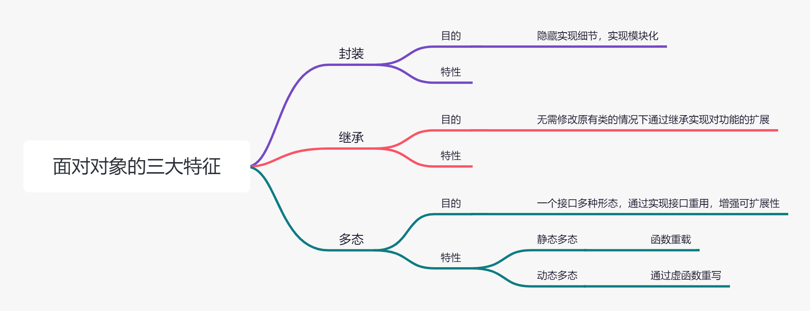

# 面向对象的三大特征

<figure><figcaption></figcaption></figure>

<figure><figcaption></figcaption></figure>

<figure><figcaption></figcaption></figure>

<figure><figcaption></figcaption></figure>

面向对象三大特性：封装，继承，多态

首先要明白，这三大特性的目的是什么，然后回答一下特性；
