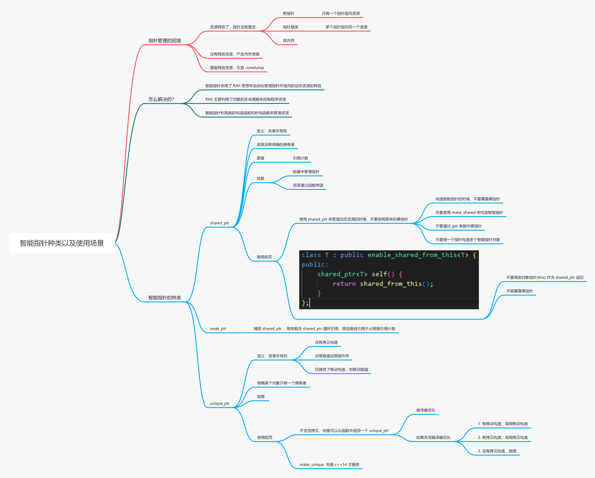

# 智能指针种类以及使用场景

<figure><figcaption></figcaption></figure>

智能指针是C++一个十分重要的知识点；

对于这种重要且庞大的知识点，我们在面试的时候不要想着要全盘托出，而是要由浅入深，具有层次性的表达；

(1) 先简单的讲一下，概念，使用，原理；

简单讲的时候，概念部分一句话概括；使用部分 注重于 使用场景和使用的api；原理部分 注重于基本原理，不需要太底层

eg:&#x20;

概念：智能指针是为了解决裸指针使用的一些缺陷；

使用：shared\_ptr, unique\_ptr, weak\_ptr，shared\_ptr的使用场景是多个指针管理一个资源的时候，常用的api有use\_count, get, 初始化；

原理：shared\_ptr是利用raii，利用构造函数和析构函数去管理指针的生命周期，不需要手动销毁指针，其中指针指向的资源，是利用引用计数去管理，当引用计数为0时资源被释放；...

(2) 再深入地讲一下 使用和原理；

深入讲的时候，概念部分可以更深入地讲一些设计理念（解决了哪些问题）；使用部分 注重于 使用的规范以及原因；原理部分 可以聊一下源码；

概念：智能指针是为了解决裸指针使用的一些缺陷，那么裸指针有哪些缺陷呢...，智能指针又是如何解决这些问题

使用：shared\_ptr使用规范，以及为什么要这么使用，如果不这么使用会造成哪些问题

原理：shared\_ptr的源码，是怎么实现的

