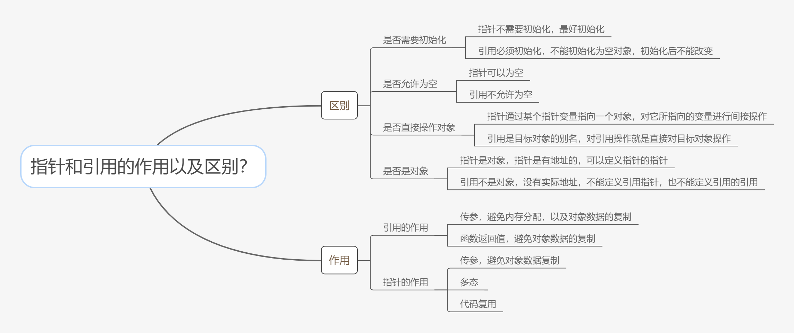

# 指针和引用的作用以及区别

<figure><figcaption></figcaption></figure>

指针和引用的区别：最起码从4个角度来说

(1) 是否需要初始化

(2) 是否允许为空

(3) 是否直接操作对象

(4) 是否是对象

然后注意一下，传参的时候，引用除了可以避免对象数据的复制，还可以避免内存分配；而指针传参的时候，它还是要至少分配一个指针对象的内存；
