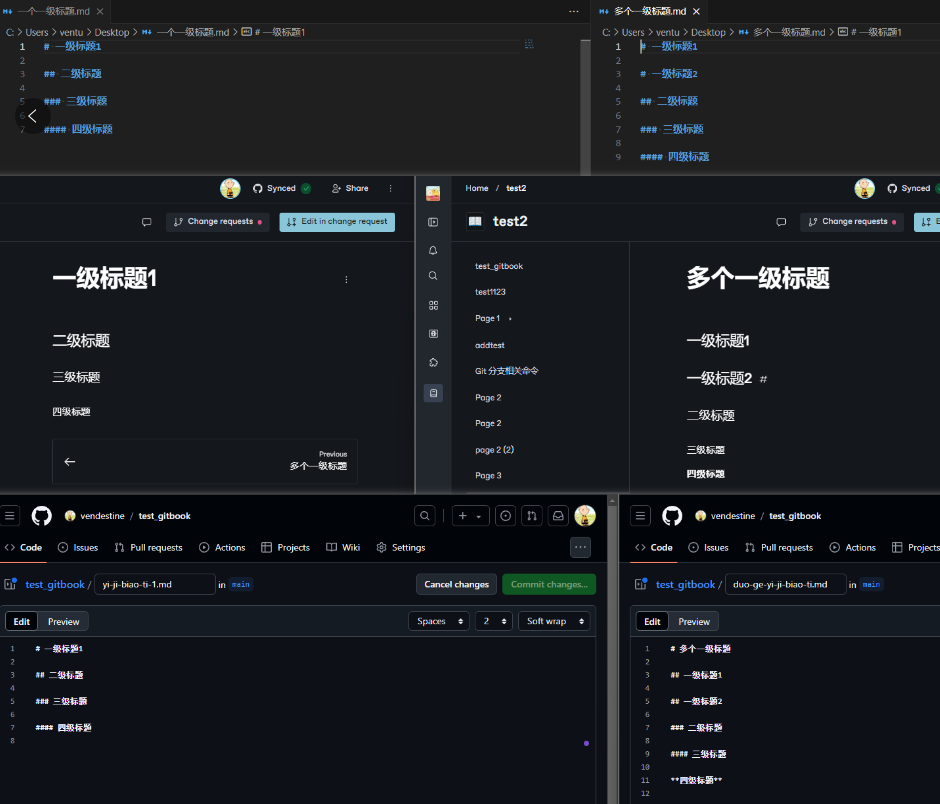

# Gitbook

## gitbook搭建博客

## gitbook page 和 github markdown

### page和markdown的转化

(1) markdown -> page

如果只有一个一级标题，自动提升，一级标题->page标题，二级->一级，依次类推；\
如果有多个一级标题，不会自动提升，markdown文件名是page标题，一级->一级，二级->二级，依次类

(2) page-> markdown&#x20;

都是自动下降，page标题->一级标题，一级标题->二级标题，依次类推、

(3) 示例

<figure><figcaption></figcaption></figure>

(4) 总结

为了保持gitbook上传的markdown，和最后同步到github的markdown的一致性。\
编辑markdown文件，一级标题是文章名字，然后内容用二三四级标题即可。\
编辑page，page标题是文章名字，然后内容用一二三级标题即可。
