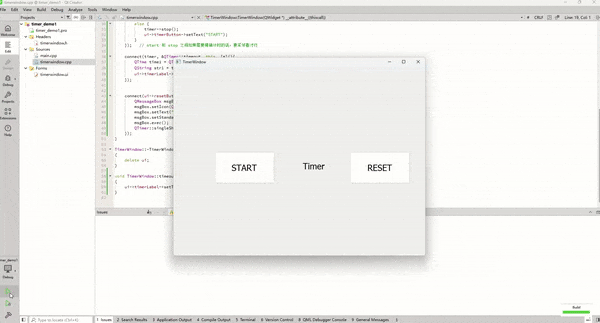

# QT定时器

定时器的应用场景：<mark style="background-color:orange;">每次timeout后，执行一些动作；或者单次timeout后，执行一些动作</mark>；


QT使用定时器，有两种方法


### 1. 使用QTimer类

QTimer是QT中自带的定时器类，借助QTimer类使用定时器很简单

1. 创建QTimer对象
2. connect QTimer::timeout信号 和 自定义的槽（handleTimeout函数)
3. 启动定时器 start
4. 停止定时器 stop

QTimer定时器的默认精度是msec，我们也可以通过setTimerType函数去调整定时器的精度


案例1：实现计时器，点击START按钮后显示现在时间，并开始计时；点击END按钮后停止计时，END后点击RESET按钮，3s后恢复初始界面；


很明显，我们需要connect(START button, clicked信号, this，开启/关闭定时器）

connect(timer对象，timeout信号，this，timeout后的操作）

connect(RESET button, clikced信号，this，弹窗 + singleShot)

<mark style="background-color:orange;">其中最后一项参数，可以直接lambda表达式写，也可以封装成槽函数，然后实现这个槽函数</mark>；


代码：

TimerWindow.h

```cpp
#ifndef TIMERWINDOW_H
#define TIMERWINDOW_H

#include <QWidget>

QT_BEGIN_NAMESPACE
namespace Ui {
class TimerWindow;
}
QT_END_NAMESPACE

class TimerWindow : public QWidget
{
    Q_OBJECT

public:
    TimerWindow(QWidget *parent = nullptr);
    ~TimerWindow();

protected slots:
    void timeoutRest();


private:
    Ui::TimerWindow *ui;
};
#endif // TIMERWINDOW_H
```


TimerWindow.cpp

```cpp
#include "timerwindow.h"
#include "ui_timerwindow.h"
#include <QTimer>
#include <QTime>
#include <QMessageBox>

TimerWindow::TimerWindow(QWidget *parent)
    : QWidget(parent)
    , ui(new Ui::TimerWindow)
{
    ui->setupUi(this);

    ui->timerButton->setText("START");
    ui->resetButton->setText("RESET");
    ui->timerLabel->setText("Timer");

    // 创建timer对象
    QTimer *timer = new QTimer(this);

    // 修改timer对象精度
    timer->setTimerType(Qt::PreciseTimer);

    connect(ui->timerButton, &QPushButton::clicked, this, [=](){
        // 如果定时器没有启动，那么启动定时器
        if (!timer->isActive()) {
            ui->timerButton->setText("END");
            timer->start(1000); // 启动定时器
        }
        // 否则关闭定时器
        else {
            timer->stop();
            ui->timerButton->setText("START");
        }
    });   // start 和 stop 之间如果需要精确计时的话，要紧邻着才行

    connect(timer, &QTimer::timeout, this, [=](){
        QTime time1 = QTime::currentTime();   // 获取时间
        QString str1 = time1.toString("hh:mm:ss:zzz"); // 时间转化为str格式
        ui->timerLabel->setText(str1);   // 渲染到label上
    });


    connect(ui->resetButton, &QPushButton::clicked, this, [=](){
        QMessageBox msgBox;
        msgBox.setIcon(QMessageBox::Information);
        msgBox.setText("Are you sure to reset timer after 3s");
        msgBox.setStandardButtons(QMessageBox::Ok);
        msgBox.exec();
        QTimer::singleShot(3000, this, &TimerWindow::timeoutRest);
    });
}

TimerWindow::~TimerWindow()
{
    delete ui;
}

void TimerWindow::timeoutRest()
{
    ui->timerLabel->setText("Timer");
}

```


demo:

<div align="left">

<figure><figcaption></figcaption></figure>

</div>


