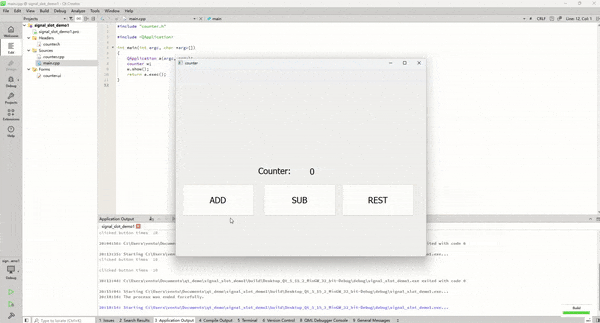

# QT信号和槽

## 入门：使用方法

### 案例1：实现一个简单计数器

案例1，展示了QT种信号和槽的多种使用方法

需求：有多个按钮，每个按钮点击一次，计数数值+1


思路：首先设计一个界面，counter界面，所以类取名counter，生成counter.h和counter.cpp，counter.ui文件；一般一个界面对应三个文件；我们ui文件里设计界面，C++文件里实现界面的逻辑和数据交互；

现在我们需要实现按钮点击，计数值 + 1；这里可以直接使用QT的预定义信号clicked()，使用QT的信号槽，我们有很多种写法


1. 使用QT Creator中的Design，选中发出信号的对象，然后go to slot，实现槽（函数）

<div align="left">

<figure><figcaption><p>声明槽函数</p></figcaption></figure>

</div>

<div align="left">

<figure><picture><source srcset="../.gitbook/assets/image (11).png" media="(prefers-color-scheme: dark)"></picture><figcaption><p>实现槽（函数）</p></figcaption></figure>

</div>

2. 使用connet，连接信号和槽；QT4采用SIGNAL和SLOT宏，QT5直接使用函数指针

QT4使用宏：clickedButton\_1

Qt5使用函数指针：clickedButton\_2

<div align="left">

<figure><figcaption><p>QT4/QT5 connect不同写法</p></figcaption></figure>

</div>


3. 使用connect，连接信号和槽；connect to functors or C++11 lambdas

connect to C++11 lambda：clickedButton\_3

<div align="left">

<figure><figcaption><p>Lambda表达式作为槽</p></figcaption></figure>

</div>


> 这篇文章，对于信号槽的多种写法总结的很好，也可以那这篇文章进行复习[https://www.cnblogs.com/jfzhu/p/13501678.html](https://www.cnblogs.com/jfzhu/p/13501678.html)


## 进阶：原理和注意事项

信号和槽的本质：<mark style="background-color:orange;">信号和槽的本质都是函数</mark>，我们可以使用QT预定义的信号函数和槽函数，也可也<mark style="background-color:orange;">自定义信号函数和槽函数</mark>；信号是公共访问的函数，在头文件中的signals关键字后声明，实现是由moc自动实现；而槽是成员函数，在头文件中的slots关键字后声明，需要自己实现，有类的访问限制；

<figure><figcaption><p>signals官方解释</p></figcaption></figure>

<figure><figcaption><p>slots官方解释</p></figcaption></figure>

这里转载一张思维导图，对于QT信号和槽总结的还是挺全面的

<figure><figcaption><p><a href="https://blog.csdn.net/sazass/article/details/104903353">https://blog.csdn.net/sazass/article/details/104903353</a></p></figcaption></figure>


### 案例2：实现一个进阶计数器

案例2，展示自定义信号和槽的使用场景，以及使用方式

需求：有三个按钮，add按钮点击，计数 + 1，sub按钮点击，计数 -1，reset按钮点击，计数复位；如果计数 = 10，需要弹窗通知；

思路：按钮点击，我们可以使用预定义信号clicked()，计数 = 10，弹窗通知，我们可以自定义弹窗信号，然后再实现对应的槽；


counter.h

```cpp
#ifndef COUNTER_H
#define COUNTER_H

#include <QWidget>

QT_BEGIN_NAMESPACE
namespace Ui {
class counter;
}
QT_END_NAMESPACE

class counter : public QWidget
{
    Q_OBJECT

public:
    counter(QWidget *parent = nullptr);
    ~counter();

signals:
    void popWindow(int num);


private slots:
    void onAddButtonClicked();
    void onSubButtonClikced();
    void onPopWindow(int num);

private:
    Ui::counter *ui;
};
#endif // COUNTER_H
```


counter.cpp

```cpp
#include "counter.h"
#include "ui_counter.h"
#include <QMessageBox>
#include <QDebug>

counter::counter(QWidget *parent)
    : QWidget(parent)
    , ui(new Ui::counter)
{
    ui->setupUi(this);

    connect(ui->addButton, SIGNAL(clicked()), this, SLOT(onAddButtonClicked()));
    connect(ui->subButton, &QPushButton::clicked, this, &counter::onSubButtonClikced);
    connect(ui->resetButton, &QPushButton::clicked, this, [=]() {
        int currentValue = ui->numberLabel->text().toInt();
        currentValue = 0;
        ui->numberLabel->setText(QString::number(currentValue));
    });


    connect(this, &counter::popWindow, this, &counter::onPopWindow);
}

counter::~counter()
{
    delete ui;
}

void counter::onAddButtonClicked()
{
    int currentValue = ui->numberLabel->text().toInt();
    ++ currentValue;
    ui->numberLabel->setText(QString::number(currentValue));
    if (currentValue == 10) emit popWindow(currentValue);
}

void counter::onSubButtonClikced()
{
    int currentValue = ui->numberLabel->text().toInt();
    -- currentValue;
    ui->numberLabel->setText(QString::number(currentValue));
    if (currentValue == 10) emit popWindow(currentValue);
}


void counter::onPopWindow(int num)
{
    QMessageBox messageBox;
    messageBox.setWindowTitle("Notification");
    messageBox.setText("You have counted for 10!");
    messageBox.setStandardButtons(QMessageBox::Ok | QMessageBox::Cancel);
    messageBox.setIcon(QMessageBox::Information);
    messageBox.exec();
    qDebug() << "clicked button times " << num << Qt::endl;
}
```


main.cpp

```cpp
#include "counter.h"

#include <QApplication>

int main(int argc, char *argv[])
{
    QApplication a(argc, argv);
    counter w;
    w.show();
    return a.exec();
}

```


demo：

<div align="left">

<figure><figcaption></figcaption></figure>

</div>


Reference:

1. [https://doc.qt.io/qt-6/signalsandslots.html](https://doc.qt.io/qt-6/signalsandslots.html)
2. [https://www.cnblogs.com/schips/p/12537360.html](https://www.cnblogs.com/schips/p/12537360.html)
3. [https://www.cnblogs.com/jfzhu/p/13501678.html](https://www.cnblogs.com/jfzhu/p/13501678.html)
4. [https://blog.csdn.net/sazass/article/details/104903353](https://blog.csdn.net/sazass/article/details/104903353)
5. [https://blog.csdn.net/weixin\_40774605/article/details/109342536](https://blog.csdn.net/weixin\_40774605/article/details/109342536)
6. [https://juejin.cn/post/6847902223691677703](https://juejin.cn/post/6847902223691677703)
