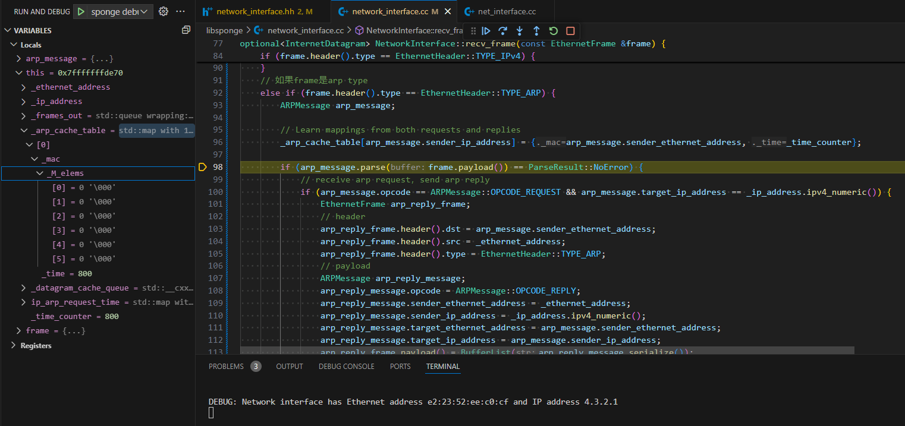
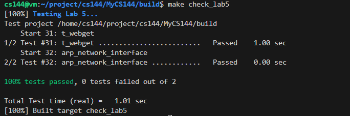
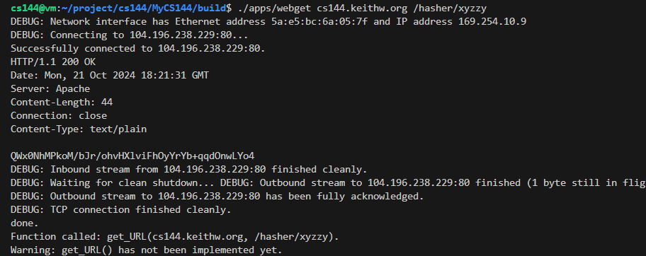

# lab 5

## 实验思路

该实验是要求实现网络接口层，其实很简单的概括就是实现arp协议；

arp协议，简单地讲，就是我们要获取下一跳的mac地址

## 实验过程

### Debug

整体来说是一个比较简单的lab，稍微调试了几次，错误原因都是一些笔误，例如条件判断写反了。

下面记录一个非常搞笑的错误。

(1) arp\_cache\_table一直为空，发送arp\_request，收到arp\_reply后，继续发送arp\_request，循环卡死

这里记录一个很蠢的错误，因为这里我们把ip和mac的信息写入arp\_cache\_table的时候，apr\_message都还没有parse，所以自然arp\_cache\_table一直为空；即使我们回复了arp\_reply，send\_datagram里，因为表里没有记录，会继续发，循环地发导致卡死。。。

<figure><figcaption></figcaption></figure>

### 结果

<figure><figcaption></figcaption></figure>

<figure><figcaption></figcaption></figure>

