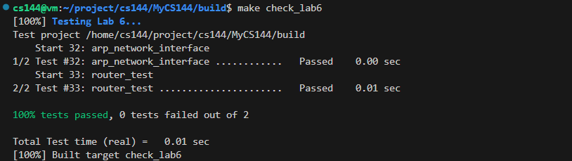
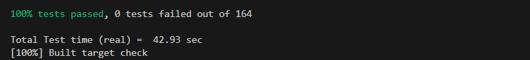

# lab6

## 实验思路

lab6，是实现路由器的转发功能

其实就是拿到下一跳的ip地址

## 实验过程

很简单，就是实现一个最长前缀匹配，其中会涉及到掩码的计算，这个可以学习一下。

### 结果

make check\_lab6

<figure><figcaption></figcaption></figure>

make check，通过所有test了，完结撒花！

<figure><figcaption></figcaption></figure>
